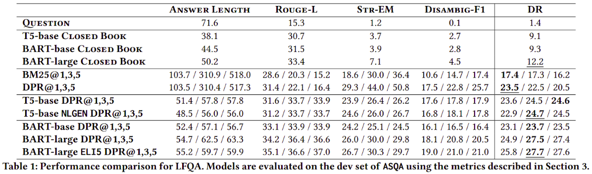
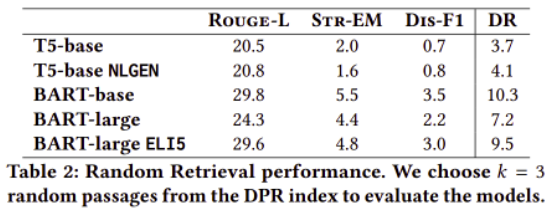
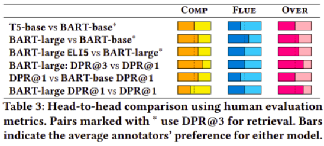

# Model Analysis & Evaluation for Ambiguous Question Answering

## Abstract
Ambiguous questions are a challenge for Question Answering models, as they require answers that cover multiple interpretations of the original query. To this end, these models are required to generate long-form answers that often combine conflicting pieces of information. Although recent advances in the field have shown strong capabilities in generating fluent responses, certain research questions remain unanswered. Does model/data scaling improve the answers' quality? Do automated metrics align with human judgment? To what extent do these models ground their answers in evidence? In this study, we aim to thoroughly investigate these aspects, and provide valuable insights into the limitations of the current approaches.

## Results




## Training
You can finetune T5-base on the ASQA dataset by running the following command:
```sh
BASE_MODEL=t5-base OPEN_BOOK=true python finetune.py
```

Similarly, you can finetune BART-large with:
```sh
BASE_MODEL=bart-large MODEL_NAME=facebook/bart-large OPEN_BOOK=true python finetune.py
```

All available environment variables are:
- `BASE_MODEL`: the base model being used (defaults to "t5-base")
- `MODEL_NAME`: the HuggingFace name of the model (defaults to **BASE_MODEL**)
- `TOKENIZER_NAME`: the HuggingFace name of the tokenizer (defaults to **MODEL_NAME**)
- `DATASET_HF_USER`: the HuggingFace user that hosts the dataset to train on (defaults to "din0s")
- `DATASET_NAME`: the HuggingFace dataset trian on (defaults to "asqa")
- `OPEN_BOOK`: whether to finetune for the open-book scenario or not (defaults to "false")

## Human Evaluation
To replicate our human evaluation study, you can use the notebook [create_pairwise_comparisons.ipynb](human_annotation/create_pairwise_comparisons.ipynb).

## ASQA Dataset
This project is built on top of the ASQA dataset. For more information, please refer to the [ASQA repository](https://github.com/google-research/language/tree/master/language/asqa). The following setup instructions come from the original codebase.

### Download
To download the ASQA dataset, run:

```
mkdir dataset
gsutil cp -R gs://gresearch/ASQA/data/ASQA.json dataset
```

Note: this requires [gsutil](https://cloud.google.com/storage/docs/gsutil).

### Setup
1. You might want to setup a virtual environment before installation.

2. Install PyTorch by following the instructions [here](https://pytorch.org/get-started/locally/#start-locally).

3. Install python packages and download the Roberta checkpoint by running:

```
sh install.sh
```

### Evaluation in one bash script
```
chmod +x ./eval.sh
./eval.sh ${RESULTS_PATH} ${EXP_NAME}
```
The final results will show on the screen and will also be generated in ./results/${EXP_NAME}/final_eval_results.json.
